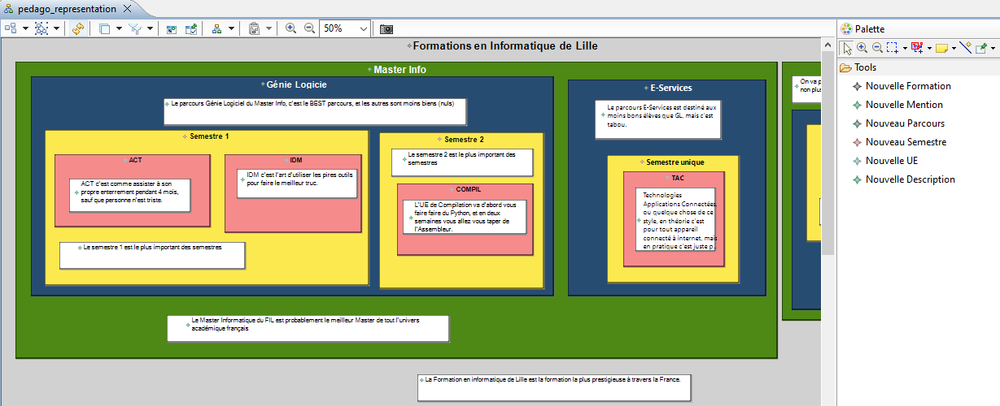

# Projet : Ingénierie Dirigée par les Modèles

Projet réalisé dans le cadre de mon Master Informatique.

Technologies utilisées :

* Acceleo,
* QVTO,
* Sirius,
* Papyrus,
* Bootstrap (génération)

## 1. Contexte du projet

Le projet consiste à réaliser une modélisation du portail pédagogique du FIL et plus généralement d'un portail pour n'importe quelle faculté.

Le portail pédagogique du FIL est un outil en ligne qui présente les informations liées aux différentes formations proposées par l'université. Ce genre de site est généralement construit page par page, avec chaque responsable de formation prenant en charge la description de ses pages. Pour maintenir une certaine homogénéité, des "templates" sont distribués aux responsables, qui construisent ensuite leurs pages en se basant sur ces modèles.

Cependant, la construction et la maintenance de ces pages restent laborieuses. Les informations ne sont pas toujours mises à jour en raison du manque de temps et certaines informations apparaissent à des endroits différents sur le site, entraînant souvent une non-synchronisation de ces informations redondantes.

Pour moderniser la gestion de ce portail, nous souhaitons utiliser une approche d'Ingénierie Dirigée par les Modèles (Model-Driven Engineering) pour générer une ou plusieurs représentations du portail. Cela permettra de décrire les informations de manière indépendante de la façon dont elles sont présentées. L'une des représentations visées est un site web en HTML/Bootstrap, et une autre en Markdown. Et également créer un langage pour modéliser des sites pédagogiques en général, et celui du FIL en particulier.

Ce site présente les formations proposées par l'université et leurs contenus, tels que les UEs, les ressources pédagogiques, les semainiers, etc. Il est possible de séparer la partie de présentation de la partie de description de l'information. La présentation concerne la façon dont les informations sont présentées, comme les onglets généraux, les UEs, etc. La description de l'information représente les informations affichées, indépendamment de la façon dont elles sont présentées. Cela permettra de gérer de manière efficace les informations qui apparaissent plusieurs fois dans différents endroits du site, comme les noms des responsables d'UE ou d'enseignement, ou les ressources (slides, code, etc.).

## 2. Problématique

L'objectif est de pouvoir générer le site web du FIL ou un document texte à partir d'une description complète des informations à présenter. Il est également souhaitable de pouvoir générer le contenu dans un site web avec un agencement ou une présentation différente. Il est également envisageable d'adapter cette présentation à des formats encore plus différents :

- Un espace virtuel/3D où chaque formation est représentée par un bâtiment avec une salle pour chaque UE
- Un fichier VoiceXML pour rendre le contenu des formations accessible via un serveur vocal interactif

Cela permettra de rendre l'information plus accessible et plus adaptable aux différents besoins et préférences de l'utilisateur.

## 3. Solution proposée

### 3.1. Architecture du projet

Le projet se situe dans le repertoire [projet](projet/) et se compose de plusieurs sous-projets :

```bash
.
├── fil.idm.markdown-master
├── fil.idm.simplemarkdown.generator
├── filportail
├── generated_outputs
├── pedago.design
├── pedago.tosite.generator
├── pedago.transfo
├── siteweb
└── univ.pedago.mm
```

- [fil.idm.markdown-master](projet/fil.idm.markdown-master/) : contient le projet avec le métamodèle **markdown**, fourni par l'équipe enseignante
- [fil.idm.simplemarkdown.generator](projet/fil.idm.simplemarkdown.generator/) : contient le projet Acceleo avec le générateur de fichier markdown
- [filportail](projet/filportail/) : contient deux modèles faits manuellement : `My.pedagomm`, modèle pédagogique, et `My.siteweb`, modèle de site; contient également la représentation d'un modèle de faculté pour ouverture par éditeur graphique (fichier `/representations.aird`)
- [generated_outputs](projet/generated_outputs/) : destiné à contenir tout modèle, document markdown, et site boostrap générés lors des transformations et générations de codes successives
- [pedago.design](projet/pedago.design/) : contient le projet Sirius de l'éditeur graphique pour la représentation d'une organisation pédagogique de faculté (fichier `/description/pedago.odesign`)
- [pedago.tosite.generator](projet/pedago.tosite.generator/) : contient le projet Acceleo avec le générateur de site en bootstrap
- [pedago.transfo](projet/pedago.transfo/) : contient les projets QVTO de transformation des modèle **markdown** et **siteweb** en modèle **pedagomm**
- [siteweb](projet/siteweb/) : contient le projet avec le métamodèle **siteweb**
- [univ.pedago.mm](projet/univ.pedago.mm/) : contient le projet avec le métamodèle **pedago**

### 3.2. Acceleo

Acceleo est un générateur de modèles de code open-source basé sur Eclipse. Il permet de générer automatiquement du code à partir de modèles en utilisant la syntaxe de modèle de transformation de modèle (MTL). Il est utilisé pour générer du code dans divers langages tels que Java, C#, PHP, etc.

Dans ce projet, Acceleo peut être utilisé pour générer automatiquement du code HTML/Bootstrap pour la mise en page du site web du FIL, ainsi que pour générer des fichiers Markdown (.md). Il utilise les modèles graphiques définis dans Sirius pour générer ces fichiers.

**Génération d'HTML obtenue depuis un modèle de site :**

```html
<html lang="fr">
	<head>
		<!-- Required meta tags -->
		<meta charset="utf-8">
		<title>IDM</title>
		<link href="https://cdn.jsdelivr.net/npm/bootstrap@5.0.2/dist/css/bootstrap.min.css" rel="stylesheet" integrity="sha384-EVSTQN3/azprG1Anm3QDgpJLIm9Nao0Yz1ztcQTwFspd3yD65VohhpuuCOmLASjC" crossorigin="anonymous">
	</head>
	<body style="background-color: #f2f2f2;">
		<div class="container my-container" style="padding: 0;">
			<nav class="navbar navbar-expand-lg navbar-light bg-light">
				<div class="navbar" id="navbarNav">
					<ul class="navbar-nav">
						<li class="nav-item active">
							<a class="nav-link" href="Faculté des Sciences &amp; Technologies.html">Accueil</a>
						</li>
						<li class="nav-item">
							<a class="nav-link" href="#" onclick="history.back()">Précédent</a>
						</li>
					</ul>
				</div>
				<a class="navbar-brand">Semestre 1 - IDM</a>
			</nav>
		</div>
		<div class="container mt-3">
			<div class="row">
				<div class="col-md-8">
					<h1>IDM</h1>
					<p class="lead">
						IDM est la meilleure matière pour tous les étudiants
					</p>
					<div>
						<h4>Responsables</h4>
						<p class="lead">
							Patrick
						</p>
						<h4>Intervenants</h4>
						<p class="lead">
							Patricia
						</p>
					</div>
				</div>
			</div>
		</div>
	</body>
</html>
```

### 3.3. QVTO

QVTO est un langage de transformation de modèles open-source basé sur Eclipse qui permet de convertir des modèles d'un format à un autre. Il est basé sur la spécification de modèle de transformation de modèle (MTL) et utilise une syntaxe similaire à celle d'Acceleo. Il est utilisé pour transformer des modèles de données d'un format à un autre, généralement pour la génération de code.

Dans ce projet, QVTO est utilisé pour convertir les modèles de données du format portail fil en format markdown et HTML/Bootstrap. Il utilise des transformations définies dans des fichiers QVTO pour convertir les modèles de données de portail fil en format markdown et HTML/Bootstrap. Ces transformations permettent de conserver la cohérence de l'information lors de la conversion des modèles d'un format à un autre.

Pour utiliser ces transformations QVTO, il est nécessaire de les lancer en passant en paramètre les modèles de données d'entrée et sortie. QVTO utilisera alors ces transformations pour convertir les modèles d'entrée en modèles de sortie.

**Transformation de la Faculté (FIL) en Folder (markdown) :**

```c#
transformation faculte2folder(in pedago : pedagomm, out markdown : simplemarkdown);

intermediate property simplemarkdown::doc : Document;

main() {
	pedago.rootObjects()[Faculté] -> map faculte2Folder();
}

mapping pedagomm::Faculté::faculte2Folder() : simplemarkdown::Folder {
	name := "My_" + self.name;
	documents += self -> faculte2Document();
}
```

**Transformation de la Faculté (FIL) en Site (HTML/Bootstrap) :**

```c#
transformation faculte2siteweb(in pedago : pedagomm, out site : siteweb);

intermediate property siteweb::portail : Site;

main() {
	pedago.rootObjects()[Faculté] -> map faculte2Site();
}

mapping pedagomm::Faculté::faculte2Site() : siteweb::Site {
	name := self.name;
	pages += self -> faculte2Page();
}
```

### 3.4. Editeur graphique Sirius

Sirius est un cadre open-source basé sur Eclipse qui permet de créer des éditeurs graphiques pour des modèles de données. Il permet de définir des vues graphiques pour les modèles de données en utilisant un langage de modèle graphique (GMF) et en fournissant des fonctionnalités pour l'édition, la navigation et la validation des modèles. Il est utilisé pour créer des éditeurs graphiques pour des modèles de données basés sur EMF.



À noter qu'il n'est pas possible actuellement de créer de Personne (Responsable ou Intervenant) depuis l'éditeur graphique.  La déclaration de Personne nécessite de passer par l'éditeur au format textuel (arborescent). Il est cependant possible d'assigner des Personnes déjà créées.

L'éditeur graphique permet déclarer de nouvelles formations, au sein desquelles on peut déclarer des mentions, qui comportent des parcours, dans lesquelles on peut déclarer des semestres, contenant des UE. Ces concepts peuvent être décorés d'une description textuelle.

Il est ainsi possible de créer et de modifier des modèles de faculté pour ensuite les convertir en modèle de document ou de site.

**Modèle graphique pour la représentation du site web FIL :**

## 4. Fonctionnalités et limites

### 4.1. Ce que le projet permet de faire

Ce projet permet de créer et d'éditer des représentations pédagogiques de facultés en utilisant des métamodèles et modèles.

Il contient :
* Trois métamodèles :
	- un métamodèle de faculté qui décrit les informations de base de la faculté ;
	- un métamodèle de fichier texte pour la représentation linéaire de l'information ; (fourni par l'équipe enseignante)
	- un métamodèle de site web pour la représentation de l'information sous forme de site web.
* Un éditeur graphique, qui permet de créer un modèle de faculté et de ses formations ;
* Deux projets de transformation :
	- Une transformation de modèle de faculté vers modèle de document texte ;
	- Une transformation de modèle de faculté vers modèle de site web.
* Deux projets de génération de texte ou de code :
	- Un projet de génération de document markdown depuis un modèle de document texte ;
	- Un projet de génération de site utilisant boostrap et html depuis un modèle de site.

### 4.2. Ce que le projet ne permet pas de faire

- L'éditeur graphique de modèle de faculté ne permet pas de créer ou de modifier des "Personnes" (Responsable ou Intervenant). Il est cependant possible de créer une Personne depuis l'éditeur de modèle textuel, et d'attribuer une Personne existante dans l'éditeur graphique.

- Il n'y a pas d'éditeur graphique permettant de créer ou d'éditer des modèles de textes ou de sites web.

- La génération automatique du projet Xtext pour la représentation textuelle n'a pas été faite en raison d'un problème lié au nommage de la classe "Faculté" dans le métamodèle qui empêche la compilation d'un fichier Xtext. Il serait envisageable de créer un nouveau métamodèle copiant le métamodèle de la Faculté, en enlevant tous les symboles non-standards. Cependant, étant donné que tous nos fichiers sont en UTF-8, la raison de ce problème est indéterminée et semble se limiter à la technologie Xtext seule.

### 4.3. Perspectives d'amélioration

- Ajouter la possibilité de créer une Personne et de l'attribuer depuis l'éditeur graphique dans un modèle de Faculté.
- Créer des pivots pour permettre la génération de contenu dans des formats différents tels qu'un espace virtuel/3D où chaque formation est un bâtiment avec une salle pour chaque UE, un fichier VoiceXML pour que le contenu des formations puisse être accédé via un serveur vocal interactif.
- Ajouter des fonctionnalités pour la maintenance du site web généré, comme la possibilité de mettre à jour les informations de manière automatique.

## 5. Conclusion

Ce projet vise à faciliter la création et la maintenance de sites web pour les universités en utilisant des métamodèles et des outils de génération automatisée. Il permet actuellement de créer et d'éditer des modèles de Faculté, ainsi que de générer des fichiers .md et .html à partir de ces modèles.

Cependant, il existe encore des améliorations possibles pour étendre les fonctionnalités de ce projet, telles que la résolution des problèmes liés au nommage, l'ajout de pivots pour la génération de contenu dans des formats différents et une meilleure flexibilité pour la personnalisation de la présentation du site web ou du document texte généré.

Ces améliorations permettraient d'accroître l'efficacité et la facilité d'utilisation de ce projet pour les universités et les responsables de site web.
